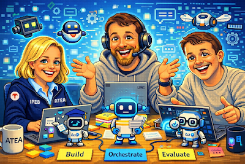

# TechnoCamp 2026 – Copilot-agenter

## Velkommen til TechnoCamp 2026

Med disse sidene får du oversikt over programmet, ressurser og innhold i de ulike øktene.

Vi i sporprogrammet håper campen gir deg mulighet til å utforske, inspirere og dele erfaringer rundt det å bygge agenter, og ikke minst ha det gøy sammen. Vi gleder oss til å sette i gang og se hva dere bygger 🤖🚀

Hilsen Hanne, Steinar og Claus

## Forutsetninger

Les [mer her](PREREQUISITES.md) for sjekkliste og oppsett det er lurt å ha klart før campen starter.

## Tidsplan

Med forbehold om endringer, her er en foreløpig tidsplan for de to dagene:

### Dag 1

| Tid | Økter | Varighet | Type |
|------|--------|----------|------|
| 09:45 - 10:30 | Intro: praktisk info og gruppedeling | 15 min | Info |
|  | [Modul 1: Hva er en agent?](moduler/01-introduksjon-til-agenter.md) | 5 min | Presentasjon |
|  | [Lab: Bordprat om agenter du vil bygge](moduler/01-introduksjon-til-agenter.md) | 10 min | Lab |
|  | [Modul 2: Hvordan komme i gang med en agent; plattformer og agentrammeverk](moduler/02-agentplattformer.md) | 15 min | Presentasjon |
| 10:30 - 10:45 | Pause | 15 min | – |
| 10:45 - 12:00 | [Lab: Valg av plattform og start å bygge din agent](moduler/02-agentplattformer.md) | 30 min | Lab |
|  | [Modul 3 del 1: Instruksjoner og kunnskap (RAG)](moduler/03-instruksjoner-kunnskap-verktoy.md) | 15 min | Presentasjon |
|  | [Lab: Jobb med instruksjoner og kunnskap](moduler/03-instruksjoner-kunnskap-verktoy.md) | 30 min | Lab |
| 12:00 - 13:00 | Lunsj | 60 min | – |
| 13:00 - 14:00 | [Modul 3 del 2: API og MCP](moduler/03-instruksjoner-kunnskap-verktoy.md) | 20 min | Presentasjon |
|  | [Lab: Jobb med API og MCP for din agent](moduler/03-instruksjoner-kunnskap-verktoy.md) | 40 min | Lab |
| 14:00 - 15:00 | [Modul 4: Under panseret på en LLM (v/Claus)](moduler/04-prompt-engineering-og-kvalitet.md) | 30 min | Presentasjon |
|  | [Lab: Videre arbeid med agenten etter modul 4](moduler/04-prompt-engineering-og-kvalitet.md) | 30 min | Lab |
| 15:00 - 15:30 | Pause / foto | 30 min | – |
| 15:30 - 16:30 | Modul 5: "The future of software delivery is agentic" (Microsoft v/Maxim) | 60 min | Foredrag |
| 16:30 - 17:00 | Lab: Fortsett bygging (valgfritt) | 30 min | Lab |
| 17:00 | Steinars time (Sønsteby) | – | Foredrag |

### Dag 2

| Tid | Økter | Varighet | Type |
|------|--------|----------|------|
| 09:30 - 10:30 | [Modul 6 del 1: Agentarkitektur](moduler/06-agentarkitektur-og-multiagent.md) | 15 min | Presentasjon |
|  | [Lab: Test ut arkitekturvalg for agenten din](moduler/06-agentarkitektur-og-multiagent.md) | 45 min | Lab |
| 10:30 - 10:45 | Pause | 15 min | – |
| 10:45 - 11:30 | [Modul 6 del 2: Copilot i Fabric (Claus)](moduler/06-agentarkitektur-og-multiagent.md) | 15 min | Presentasjon |
|  | [Lab: Siste arbeidsøkt med din agent](moduler/06-agentarkitektur-og-multiagent.md) | 30 min | Lab |
| 11:30 - 12:00 | [Modul 7: Governance](moduler/07-sikkerhet-governance.md) | 15 min | Presentasjon |
|  | [Oppsummering, tilbakemeldinger og demoer](moduler/08-avslutning.md) | 15 min | Oppsummering |
| 12:00 | Lunsj og hjemreise | – | – |

## Moduloversikt

| # | Tittel | Nøkkeltemaer |
|---|--------|--------------|
| 1 | [Hva er en agent?](moduler/01-introduksjon-til-agenter.md) | Praktisk info, grupper, begreper og forståelse |
| 2 | [Agentplattformer](moduler/02-agentplattformer.md) | Plattformer, agentrammeverket, første steg |
| 3 | [Agentens rammeverk](moduler/03-instruksjoner-kunnskap-verktoy.md) | RAG, verktøy, API og MCP |
| 4 | [Under panseret på LLM](moduler/04-prompt-engineering-og-kvalitet.md) | Teknisk innblikk i hvordan agentene virker |
| 5 | Github Copilot: Future of software delivery is agentic | Perspektiver |
| 6 | [Agentarkitektur](moduler/06-agentarkitektur-og-multiagent.md) | Arkitektur, Orkestrator, multiagenter, A2A, Copilot i Fabric |
| 7 | [Governance, evaluering og publisering](moduler/07-sikkerhet-governance.md) | Agent365, sikkerhet, evaluering og publisering |
| 8 | [Avslutning, oppsummering og deling](moduler/08-avslutning.md) | Oppsummering, demoer og tilbakemeldinger |

## Ressurser

**Plattformer:**
- [Microsoft M365 Copilot](https://m365.cloud.microsoft)
- [Microsoft Copilot Studio](https://copilotstudio.microsoft.com)
- [Azure AI Foundry](https://ai.azure.com)
- [M365 Agents SDK](https://learn.microsoft.com/en-us/microsoft-365/agents-sdk/)

**Protokoller:**
- [Model Context Protocol (MCP)](https://modelcontextprotocol.io/)
- [A2A Protocol](https://a2aprotocol.org)

**Læring:**
- [Microsoft Learn – AI agents](https://learn.microsoft.com/en-us/ai)
- [AI-102: Azure AI Engineer Associate](https://learn.microsoft.com/credentials/certifications/azure-ai-engineer/)
- [Microsoft Copilot Studio dokumentasjon](https://learn.microsoft.com/en-us/microsoft-copilot-studio)
- [Copilot Studio Agent Academy](https://microsoft.github.io/agent-academy)
- [Skills for Copilot Studio: Build agents from YAML code, up to 20x Faster](https://microsoft.github.io/mcscatblog/posts/skills-for-copilot-studio/)
- [Copilot Developer Camp](https://microsoft.github.io/copilot-camp)
