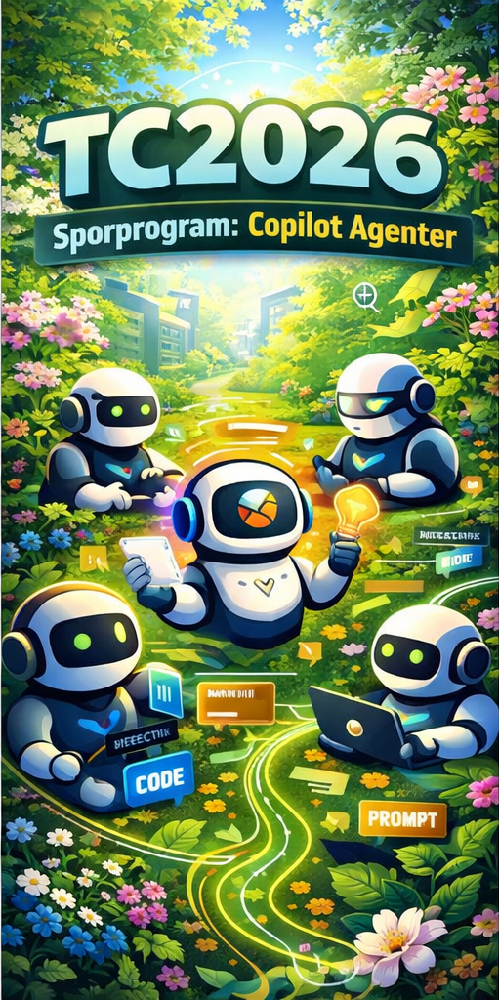

# TechnoCamp 2026 – Bygg din egen AI-agent

Velkommen til TechnoCamp 2026! 

Gjennom disse sidene får du oversikt over programmet, ressurser og innhold i de ulike sesjonene.

Vi i sporprogrammet håper campen gir deg mulighet til å utforske, inspirere og dele erfaringer rundt det å bygge agenter, og ikke minst ha det gøy sammen. Vi gleder oss til å sette i gang🤖🤖🤖🤖

Hilsen Steinar, Hanne og Claus

## Tidsplan

### Dag 1

| Tid | Sesjon | Type | Varighet |
|-----|--------|------|----------|
| 09:00 | [1: Velkommen og introduksjon](sesjoner/01-velkommen-og-introduksjon.md) | Presentasjon | 20 min |
| 09:20 | Lab: Idé og planlegging | Lab | 40 min |
| 10:00 | [2: Kom i gang med en agent](sesjoner/02-kom-i-gang-med-en-agent.md) | Presentasjon | 20 min |
| 10:20 | Lab: Hello Copilot Agent | Lab | 55 min |
| 11:15 | Pause | – | 15 min |
| 11:30 | [3: Koble til data og handlinger](sesjoner/03-koble-til-data-og-handlinger.md) | Presentasjon | 20 min |
| 11:50 | Lab: Integrasjoner og verktøy | Lab | 70 min |

### Dag 2

| Tid | Sesjon | Type | Varighet |
|-----|--------|------|----------|
| 09:00 | [4: Prompt engineering og kvalitet](sesjoner/04-prompt-engineering-og-kvalitet.md) | Presentasjon | 20 min |
| 09:20 | Lab: Test og trim din agent | Lab | 55 min |
| 10:15 | Pause | – | 15 min |
| 10:30 | [5: Agentarkitektur og multi-agent](sesjoner/05-agentarkitektur-og-multiagent.md) | Presentasjon | 20 min |
| 10:50 | Lab: Multi-agent / poler agent | Lab | 40 min |
| 11:30 | [6: Sikkerhet og governance](sesjoner/06-sikkerhet-governance.md) | Presentasjon | 20 min |
| 11:50 | [7: Avslutning – demo og oppsummering](sesjoner/07-avslutning.md) | Demo/refleksjon | 30 min |

## Sesjonsoversikt

| # | Tittel | Nøkkeltemaer |
|---|--------|--------------|
| 1 | Velkommen og introduksjon | Agenttyper (retrieval → task → autonomous), business case |
| 2 | Kom i gang med en agent | Plattformvalg, Copilot Studio, generative orchestrator |
| 3 | Koble til data og handlinger | RAG, verktøy, MCP, Power Automate, REST API |
| 4 | Prompt engineering og kvalitet | Instructions vs. descriptions, testing, dynamic chaining |
| 5 | Agentarkitektur og multi-agent | Child vs. connected agents, Hub-and-spoke, A2A |
| 6 | Sikkerhet og governance | Entra ID, least privilege, content moderation, Purview |
| 7 | Avslutning | Demo-runde, takeaways, neste steg |

## Forutsetninger

Se [PREREQUISITES.md](PREREQUISITES.md) for sjekkliste og oppsett.

## Ressurser

**Plattformer:**
- [Microsoft Copilot Studio](https://copilotstudio.microsoft.com)
- [Azure AI Foundry](https://ai.azure.com)
- [Copilot Studio – kom i gang (Microsoft Learn)](https://learn.microsoft.com/en-us/microsoft-copilot-studio/fundamentals-get-started)

**Protokoller og SDK:**
- [Model Context Protocol (MCP)](https://modelcontextprotocol.io/)
- [A2A Protocol](https://a2aprotocol.org)
- [M365 Agents SDK](https://learn.microsoft.com/en-us/microsoft-365/agents-sdk/)

**Læring:**
- [Microsoft Learn – AI agents](https://learn.microsoft.com/en-us/ai/)
- [AI-102: Azure AI Engineer Associate](https://learn.microsoft.com/credentials/certifications/azure-ai-engineer/)

## Lisens

MIT

---

*Spørsmål? Kontakt [steinar.stalsberg@atea.no](mailto:steinar.stalsberg@atea.no)*
