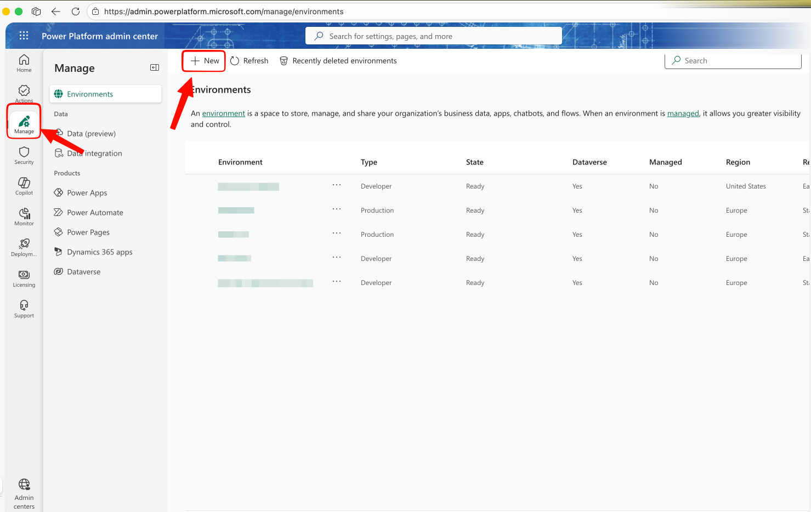
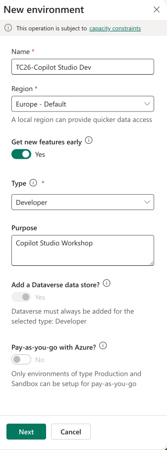
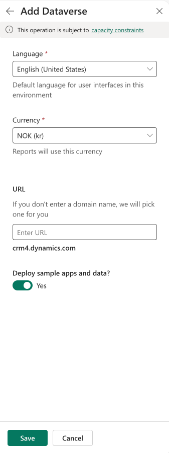
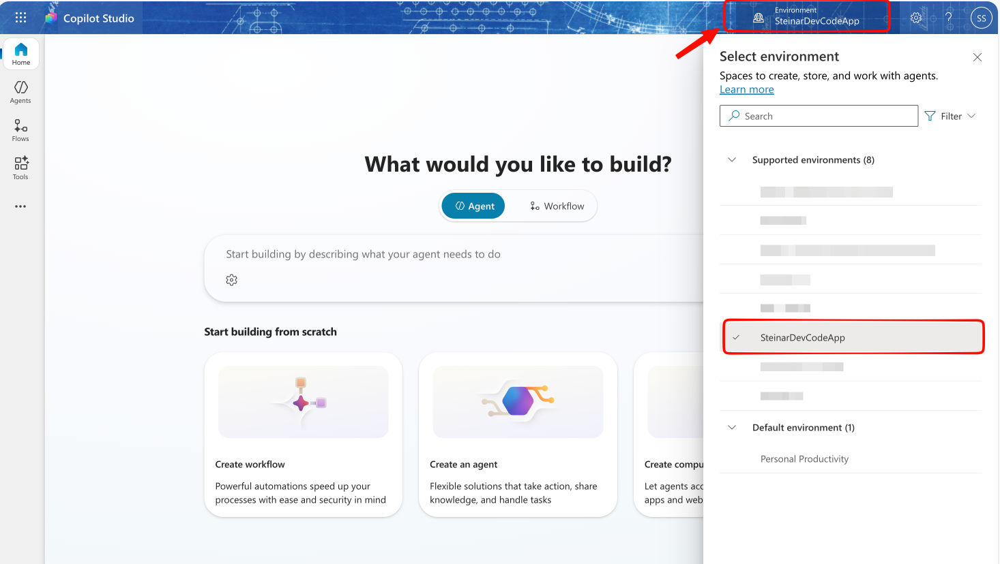
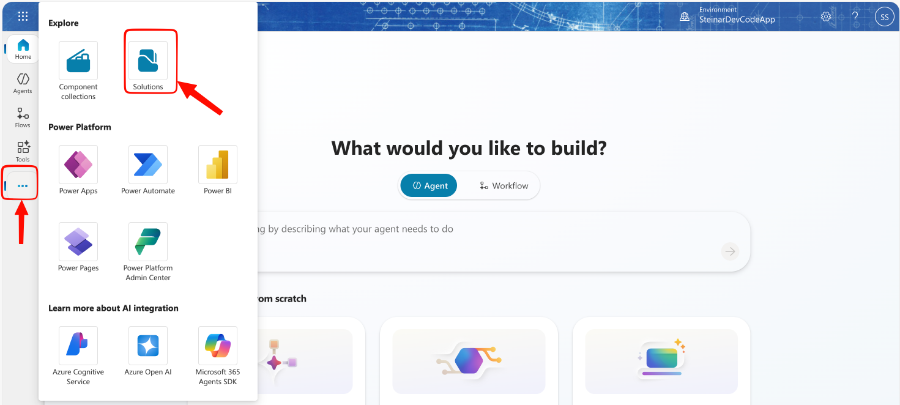
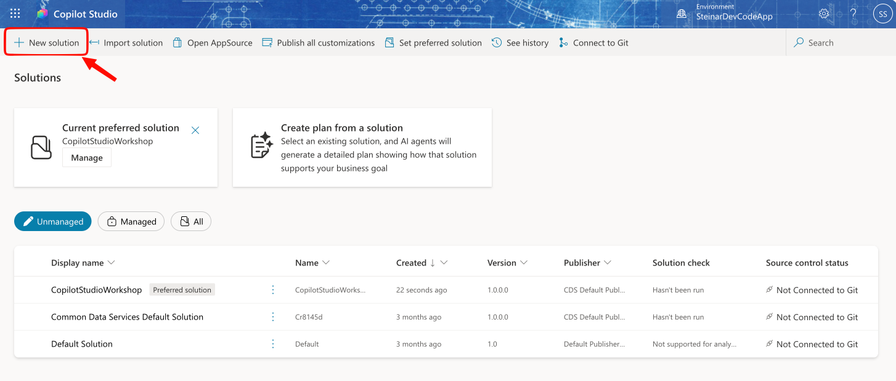
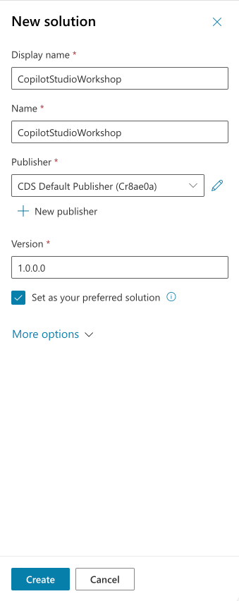

# Forberedelser - Sett opp ditt Atea-miljø for Copilot Studio

**Passer for:** Deltakere som skal bruke Copilot Studio i Atea-tenant  
**Mål:** Du får et eget miljø med Dataverse i Atea og har valgt det i Copilot Studio

## Steg 1 - Opprett ditt eget miljø i Power Plattfomr Admin Center

1. Gå til [Power Platform admin center](https://admin.powerplatform.microsoft.com).
2. Velg **Manage** og deretter **Environments**.

3. Klikk **New** for å opprette et nytt miljø.
4. Fyll inn miljødetaljene:

- **Name**: bruk et tydelig navn, for eksempel `fornavn-copilotstudio-dev`
- **Region**: velg `Europe`
- **Get new features early**: valgfritt, men kan gi tilgang til nye funksjoner før de rulles ut bredt. Støttes ikke i alle regioner.
- **Type**: `Developer`
- **Purpose**: valgfritt, for eksempel `Workshop for Copilot Studio`

5. Klikk **Next** og fullfør Dataverse-oppsettet:

- **Language**: bruk ønsket standardspråk, velg norsk eller engelsk
- **Currency**: velg relevant valuta (ikke relevant for denne workshopen)
- **URL name**: valgfritt, men lurt å sette i prosjektets navn for å lettere kjenne det igjen senere
- **Deploy sample apps and data**: valgfritt - lager sample data i dataverse du vil bruke til agenttesting

6. Klikk **Save** og vent til miljøet er ferdig provisjonert. Dette kan ta noen minutter.

`NB! Det er kun mulig å ha 3x utviklermiljøer per bruker så om du har laget utviklermiljøer tidligere, må du gjenbruke eller slette ett av dem dersom du vil opprette et nytt for denne workshopen.`

---

## Steg 2 - Verifiser at miljøet er klart Copilot Studio

1. Gå til [Copilot Studio](https://copilotstudio.microsoft.com).
2. Se øverst til høyre etter miljøvelgeren.
3. Velg miljøet du nettopp opprettet.

Hvis miljøet ikke dukker opp i Copilot Studio senere, er vanligste årsaker:

- miljøet er ikke ferdig provisjonert ennå
- du er logget inn med feil konto
- miljøet mangler Dataverse eller ligger i en region som ikke støttes

## Steg 3 - Sett opp en default solution i miljøet (valgfritt)

Hvis du vil jobbe mer strukturert med eksport, flytting mellom miljøer eller ALM, kan du opprette en egen solution i miljøet og bruke den som foretrukket løsning.

1. I Copilot Studio, gå til **Solutions** i venstremenyen

2. Klikk på **+ Create** og velg **Blank solution**

3. Gi solution et navn, for eksempel `CopilotStudioWorkshop`
4. Du kan la Publisher være standard eller lage en ny hvis du ønsker det
5. Klikk på "Set as your preferred solution"
6. Klikk **Create** og vent til løsningen er opprettet  

7. Nå vil alle nye komponenter du oppretter i Copilot Studio automatisk legges i denne løsningen, og det blir enklere å holde oversikt og flytte komponenter mellom miljøer senere.

## Nyttige lenker

- [Power Apps](https://make.powerapps.com)
- [Power Platform admin center](https://admin.powerplatform.microsoft.com)
- [Copilot Studio](https://copilotstudio.microsoft.com)
- [Work with Power Platform environments in Copilot Studio](https://learn.microsoft.com/microsoft-copilot-studio/environments-first-run-experience)
- [Create and manage environments in the Power Platform admin center](https://learn.microsoft.com/power-platform/admin/create-environment)
- [Power Platform environments overview](https://learn.microsoft.com/power-platform/admin/environments-overview)
- [Create and manage solutions in Copilot Studio](https://learn.microsoft.com/microsoft-copilot-studio/authoring-solutions-overview)
