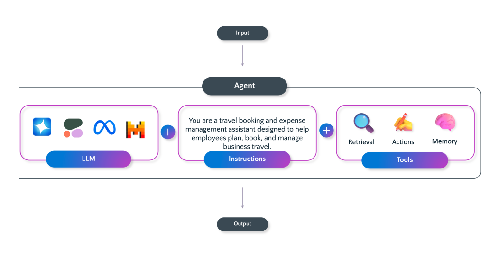
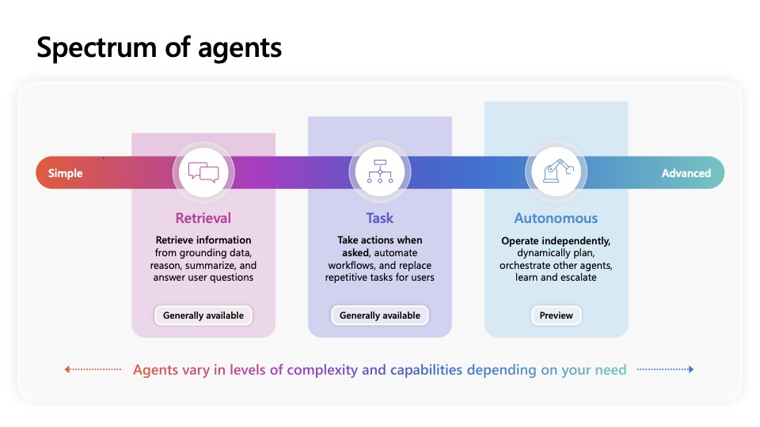

<!-- _class: lead -->
# Bygg din egen AI-agent
## TechnoCamp 2026

---

<!-- _class: lead -->
# Modul 1
## Introduksjon til AI-agenter

---

# Hva er en AI-agent?

En AI-agent er et intelligent program som bruker en eller flere språkmodeller til å forstå behov, resonnere og utføre oppgaver for en bruker eller et system.

---

# Hva består en agent av?

| Byggekloss | Rolle |
| --- | --- |
| Språkmodell | Forstår språk, resonnerer og svarer |
| Instruksjoner | Setter rolle, grenser og prioriteringer |
| Kunnskap | Gir tilgang til dokumenter, data og kontekst |
| Verktøy | Lar agenten gjøre noe i systemer og API-er |
| Orkestrering | Velger neste steg og rekkefølge |
| Trigger | Starter fra brukerinput eller en hendelse |

Ikke alle agenter trenger å bruke alle delene.

---

---

# Tre agenttyper

| Type | Hva den gjør | Eksempel |
| --- | --- | --- |
| Retrieval | Søker og svarer over egne data | FAQ-agent over SharePoint-dokumenter |
| Task | Skriver til backend, bruker APIer | Bestillingsagent som oppretter ordre i et CRM-system |
| Autonomous | Jobber mot mål, instruksjoner, verktøy og triggere | Fakturaagent som overvåker innboks og bokfører |

---

---

# Når passer en agent godt?

| Passer godt | Passer dårlig |
| --- | --- |
| Variabelt eller uklart behov | Helt faste regler og skjemaer |
| Kombinasjon av kunnskap og handling | Krav om høy presisjon uten rom for tolkning |
| Flere steg før svar eller utførelse | Irreversible handlinger uten godkjenning |
| Dialog, oppfølging og kontekst | Dårlige eller motstridende datakilder |

---

# Hvorfor satse på AI-agenter?

**1,3 milliarder AI-agenter innen 2028 (IDC)**

**Verdi**
- Produktivitet og lavere kostnad
- Bedre kvalitet og nøyaktighet
- Compliance og sikkerhet
- Skalering på tvers av team og prosesser

For Atea betyr dette både intern bruk og nye leveranser til kunder.

---

# Hvordan Microsoft tenker virksomheter tar i bruk agenter

**Tre kilder til agenter**
- Microsoft-agenter
- Partneragenter (ServiceNow, SAP, Salesforce, etc.)
- Egne agenter bygget av virksomheten på andre plattformer

---

# Diskusjon i grupper

- Hvilken jobb gjør du i dag som en agent kunne gjort 80 % av?
- Hva er den største risikoen ved å la en agent handle autonomt i din virksomhet?
- Copilot Studio vs. å kode selv: hva foretrekker du, og hvorfor?
- Er 1,3 milliarder innen 2028 noe du tror skjer og hvilke muligheter, utfordringer, trusseler skaper det for IT-bransjen?

---

# Noen forslag til agentideer

| Idé | Typisk verdi | Mulig plattform |
| --- | --- | --- |
| Tilbudsassistent | Raskere tilbudsarbeid | Copilot Studio |
| Onboarding-guide | Raskere svar til nyansatte | Copilot Studio |
| Driftsvarsel-agent | Raskere oppfølging av hendelser | Microsoft Foundry |
| Kompetanseassistent | Finne riktig konsulent raskere | Copilot Studio |
| Møteforbereder | Bedre forberedte kundemøter | Microsoft 365 Agents SDK |
| Teknisk FAQ-bot | Skalerbar kunnskapsdeling | Copilot Studio |

---

# Laboppgave: Beskriv agentideen din

| Punkt | Notater |
| --- | --- |
| Navn på agenten |  |
| Hvem skal bruke den? |  |
| Primær oppgave - hva skal agenten gjøre? |  |
| Forretningsverdi |  |

### Gruppen gir tilbakemelding på hver idé:

- Er problemet agenten skal løse tydelig?
- Er agentens målgruppe definert?

2-3 frivillige deler agentideen sin i plenum.

---

# Hva har vi gått igjennom i denne modulen?

1. Forstår hva en AI-agent er og hva den består av
2. Skiller mellom ulike agenttyper og når de passer godt
3. Beskriver en første agentidé med målgruppe, oppgave og verdi
