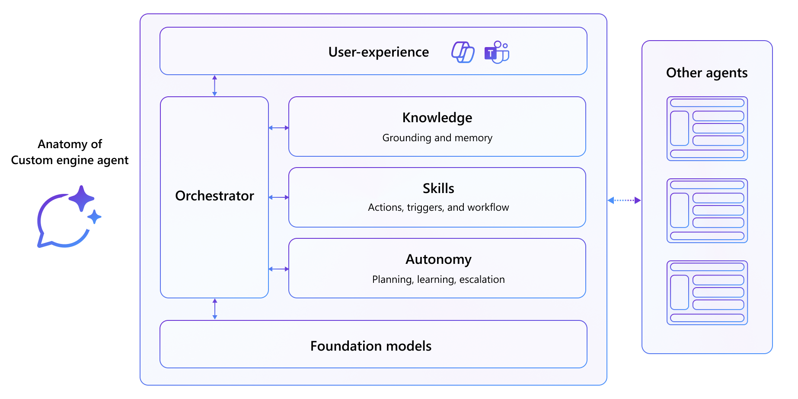

<!-- _class: lead -->

# Bygg din egen AI-agent

## TechnoCamp 2026

---

<!-- _class: divider -->
# Modul 1
## Introduksjon til AI-agenter

---

# Hva er en AI-agent?

En AI-agent er et intelligent program som bruker en eller flere språkmodeller til å forstå kontekst, ta beslutninger og utføre handlinger ved hjelp av verktøy for en bruker eller et system.

---

# Hva består en agent av?

| Nøkkeldel | Rolle |
| --- | --- |
| Språkmodell | Forstår språk, resonnerer og svarer |
| Instruksjoner | Setter rolle, grenser og prioriteringer |
| Kunnskap | Gir tilgang til dokumenter, data og kontekst |
| Verktøy | Lar agenten gjøre noe i systemer og API-er |
| Minne / state | Husker kontekst og tidligere interaksjoner |
| Orkestrering (Planlegging) | Velger neste steg og rekkefølge |
| Trigger | Starter fra brukerinput eller en hendelse (event) |

Ikke alle agenter bruker eller trenger å bruke alle delene.

---

---

# Agenttyper med eksempler

| Type | Hva den gjør | Eksempel |
| --- | --- | --- |
| Retrieval | Leser og svarer over egne data | FAQ-agent over SharePoint-dokumenter |
| Task / Action | Utfører handlinger i systemer | Bestillingsagent som mottar og oppretter ordre i et CRM-system |
| Orkestrator | Planlegger og kombinerer flere steg | Fakturaagent som overvåker innboks og bokfører |

---

# Når passer en agent godt?

| Når det passer godt | Når det ikke passer |
| --- | --- |
| Variabelt eller uklart behov | Helt faste regler og skjemaer |
| Kombinasjon av kunnskap og handling | Krav om deterministisk og 100 % korrekt resultat (f.eks. finansielle beregninger) |
| Flere steg før svar eller utførelse | Irreversible handlinger uten godkjenning |
| Dialog, oppfølging og kontekst | Dårlige eller motstridende datakilder |

---

<!-- _class: action -->
# Hvorfor satse på AI-agenter?

Estimert 1,3 milliarder AI-agenter innen 2028 (IDC)

- **Produktivitet:** mindre manuelt arbeid og raskere oppfølging
- **Kvalitet:** mer konsistente svar og færre feil
- **Compliance:** bedre sporbarhet, logging og tilgangsstyring
- **Skalering:** samme mønster kan brukes på tvers av team og prosesser

For Atea betyr dette både interne gevinster og nye leveranser til kunder.

---

# Tre skift i måten vi jobber på

- AI-assistenten blir et nytt grensesnitt for arbeid
- Agenter orkestrerer flere steg og handlinger
- Et lag av AI kobler sammen dokumenter, møter, chat og forretningsdata

Verdien flytter seg fra å lete i systemer til å få svar og utført oppgaver direkte i arbeidsflyten.

---

# Hvordan Microsoft tenker virksomheter tar i bruk agenter

**Tre kilder til agenter**

- Microsoft-agenter
- Partneragenter (ServiceNow, SAP, Salesforce, etc.)
- Egne agenter bygget av virksomheten på egne eller tredjeparts plattformer

---

<!-- _class: action -->

### Diskusjon

- Hvilken oppgave gjør du i dag som en agent kunne løst 80 % av?
- Hva er den største risikoen ved å la en agent handle autonomt i din virksomhet?
- Copilot Studio vs. å kode selv: hva foretrekker du, og hvorfor?
- Er 1,3 milliarder innen 2028 noe du tror skjer og hvilke muligheter, utfordringer, trusseler skaper det for IT-bransjen?

---

# Noen forslag til agentideer

| Idé | Typisk verdi | Mulig plattform |
| --- | --- | --- |
| Tilbudsassistent | Raskere tilbudsarbeid | Copilot Studio |
| Onboarding-guide | Raskere svar til nyansatte | Copilot Studio |
| Driftsvarsel-agent | Raskere oppfølging av hendelser | Microsoft AI Foundry |
| Kompetanseassistent | Finne riktig konsulent raskere | Copilot Studio |
| Møteforbereder | Bedre forberedte kundemøter | Microsoft 365 Agents SDK |
| Teknisk FAQ-bot | Skalerbar kunnskapsdeling | Copilot Studio |

---

<!-- _class: action -->

### Lab

# Beskriv din første agentidé

| Punkt | Notater |
| --- | --- |
| Navn på agenten |  |
| Hvem skal bruke den? |  |
| Primær oppgave – hvilken konkret handling eller verdi skal agenten levere? |  |
| Forretningsverdi |  |

**Gruppen gir tilbakemelding på hver idé:**

- Er problemet agenten skal løse tydelig?
- Er agentens målgruppe definert?

---

# Hva har vi gått igjennom i denne modulen?

1. Kan forklare hva en AI-agent er og hvilke deler den består av
2. Skiller mellom ulike agenttyper og når de passer godt
3. Beskriver en første agentidé med målgruppe, oppgave og verdi