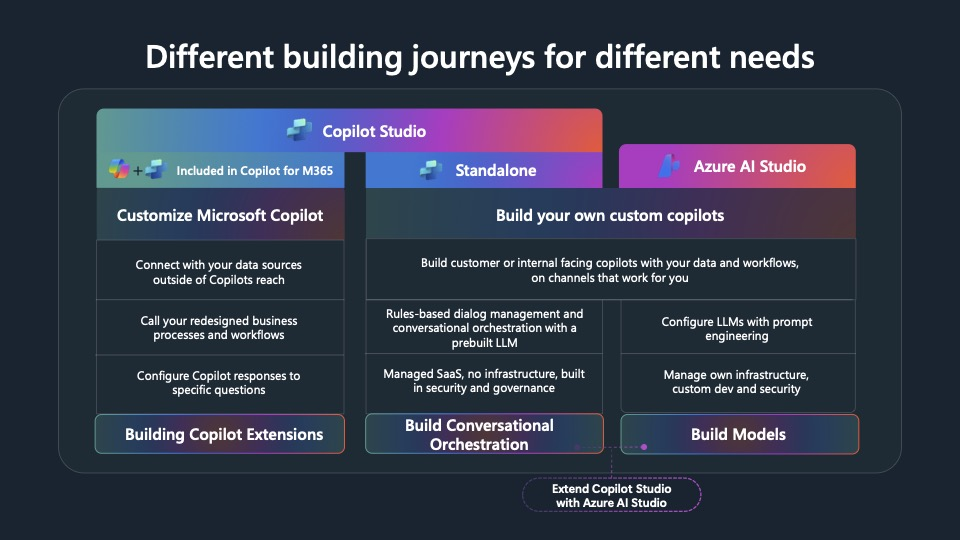
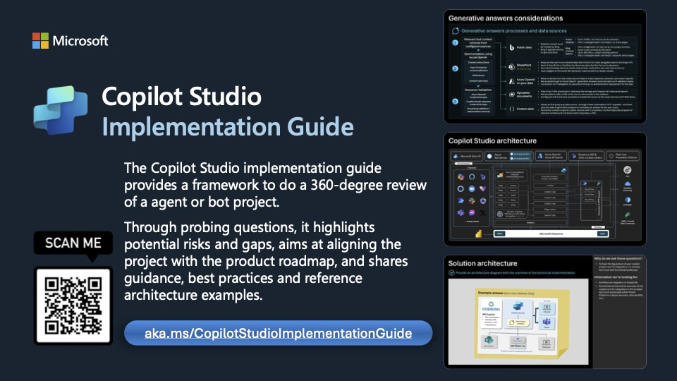

<!-- _class: lead -->
# Modul 2
## Agentplattformer

---

# Microsoft-bygde agenter

| Agent | Kort forklart |
| --- | --- |
| `People (Frontier)` | Person- og organisasjonsagent i Microsoft 365 Copilot |
| `Workflows Agent (Frontier)` | Lager og kjører workflows med naturlig språk |
| `App Builder (Frontier)` | Lager lette, interaktive apper uten kode |
| `Cowork (Frontier)` | Utfører oppgaver på tvers av Microsoft 365 på dine vegne |
| `Planner (Frontier)` | Planner-agent i Copilot |
| `Learning (Frontier)` | Learning-agent i private preview |
| `Project Opal (Frontier)` | Oppgavebasert agent som kan jobbe asynkront via Cloud PC |

---

# Agentplattformer

- Samme agentidé kan bygges på flere måter, men plattformvalget påvirkes av utviklerkompetanse og krav til fleksibilitet
- Valg av plattform bestemmer hvilke data, verktøy, kanaler og sikkerhetsmekanismer som er tilgjengelige for agenten og sluttbrukeren

---

# Microsofts agentøkosystem

| Plattform | Hva den er | Når den passer |
| --- | --- | --- |
| Agent Builder i M365 Copilot | Deklarative agenter direkte i Microsoft 365 Copilot | Rask prototyping og personlig eller teamnær produktivitet |
| SharePoint agents | Agent bygget direkte over SharePoint-områder, biblioteker, mapper eller filer | Når agenten skal svare over et avgrenset dokumentsett i SharePoint eller Teams |
| Copilot Studio | Low-code og pro-code plattform for egne agenter | Du vil bygge en agent for team, prosess eller fagområde |
| Teams SDK | Kodebibliotek for samarbeidsagenter i Teams og Copilot | Når agenten skal jobbe i kanaler, møter eller annen gruppebasert samhandling |
| Microsoft 365 Agents SDK | Agentutvikling med kode for M365 Copilot, Teams, web og egne flater | Når du trenger å tilpasse agenten med egen kode, egne API-er m.m. |
| Microsoft AI Foundry Agent Service | Agenttjeneste i Azure med low-code og pro-code valg | Når du vil bygge, drifte, publisere og skalere i Azure |
| Microsoft Agent Framework (preview) | Rammeverk for orkestrering, workflows og multi-agent | Når flere spesialiserte agenter må samarbeide |

---

# Sammenligning av byggespor

| Egenskap | Copilot Studio | Teams SDK | Microsoft 365 Agents SDK | Foundry |
| --- | --- | --- | --- | --- |
| Tilnærming | Low-code | Pro-code | Pro-code | Low-code eller pro-code |
| Typisk verktøy | Copilot Studio UI | Visual Studio / VS Code | Visual Studio / VS Code + Agents Toolkit | Foundry portal eller Agents Toolkit |
| Publisering | Egen organisasjon | Organisasjon eller store (AppSource) | Organisasjon, store (AppSource) og flere kanaler | Organisasjon eller store (AppSource) |
| Kanaler | M365 Copilot, Teams, partnerapper, mobil og web | M365 Copilot og Teams | M365 Copilot, Teams, partnerapper, mobil og web | M365 Copilot og Teams |
| Orkestrering (planlegging) | Copilot Studio | Innebygd action planner | Du tar med egen orkestrering | Du tar med egen orkestrering |
| Modeller | Copilot Studio-modeller | Valgfrie modeller | Valgfrie modeller | Azure OpenAI (Foundry) eller egne modeller |
| Språk | PowerFX, YAML | C#, TypeScript, JavaScript, Python | C#, JavaScript, Python | Python og C# |

---

# Når du er i tvil om plattformvalg

- Prøv `Agent Platform Advisor`
- Den hjelper deg å velge mellom Microsofts agentplattformer ut fra scenario og krav
- Lenke: `https://microsoft.github.io/cat/agent-platform-advisor/index.html`

---

# Tre raske innganger i Microsoft 365

|  | Agent Builder i M365 Copilot | SharePoint agents | Copilot Studio |
| --- | --- | --- | --- |
| Hvem det er for | Sluttbrukere og superbrukere | Innholdseiere og fagmiljøer | Makers, konsulenter og utviklere |
| Hvor du bygger | Inne i Microsoft 365 Copilot | Fra et SharePoint-område, bibliotek, mappe eller filsett | Egen byggeflate |
| Typisk bruk | En enkel deklarativ agent for en rolle eller et team | En agent over et konkret dokumentsett eller prosjektrom | En agent med egne kanaler, verktøy, kunnskap og styring |
| Styrke | Lav terskel og rask oppstart | Kort vei fra innhold til nyttig agent | Mer kontroll og flere utvidelsesmuligheter |

---

# Tre byggevalg med mer kontroll

|  | Microsoft 365 Agents SDK | Microsoft AI Foundry Agent Service | Microsoft Agent Framework (preview) |
| --- | --- | --- | --- |
| Primært fokus | Bygge agent-apper for M365 Copilot, Teams, web og egne flater | Bygge, kjøre, drifte og publisere agenter i Azure | Orkestrere agenter, verktøy og workflows i kode |
| Velg dette når | Kanal og brukeropplevelse på tvers av flater er viktigst | Managed runtime, sikkerhet, verktøy og observability er viktigst | Flere agenter må samarbeide eller følge en tydelig flyt |
| Du eier selv | Appkode, integrasjoner og kanalopplevelse | Agentlogikk, konfigurasjon og Azure-oppsett | Orkestreringslogikk og hvordan agentene samarbeider |
| Typisk styrke | Tett på Teams og Copilot | RBAC, tracing, verktøy, publisering og skalering | Multi-agent, state, human-in-the-loop og eksplisitte workflows |
| Typisk tradeoff | Mer ansvar for app og integrasjoner | Tettere kobling til Azure-plattformen | Ikke en ferdig kanalflate eller driftstjeneste alene |

---

# Hva er en custom engine agent?

- Mer fleksibel enn en ren deklarativ agent
- Du styrer orkestrering (planlegging), modellvalg og integrasjoner eksplisitt
- Kan bygges low-code i `Copilot Studio` (custom engine)
- Kan bygges pro-code med `Teams SDK`, `Microsoft 365 Agents SDK` eller `Microsoft AI Foundry`-agenter integrert i Microsoft 365
- Godt valg når standard Copilot-opplevelser ikke er nok, eller når du trenger mer avansert arbeidsflyt og proaktiv automasjon

---

<!-- _class: action -->

### Demo – fra idé til første agent (5 min)
# Vår første agent: Pappavits-agenten

| Punkt | Første versjon |
| --- | --- |
| Målgruppe | Deltakere på TechnoCamp |
| Oppgave | Generere korte pappa-vitser på norsk |
| Input | Enkelt prompt (f.eks. tema eller tilfeldig) |
| Output | 1–3 korte vitser (maks 2 linjer per vits) |
| Verdi | Rask, enkel og underholdende opplevelse som viser agentflyt |

- Opprett agent i valgt plattform (f.eks. Copilot Studio)
- Legg inn instruksjon/prompt (rolle + stil)
- Test i chat (iterer raskt på prompt)
- Publiser til Teams eller Copilot

---

# Hva har vi gått igjennom i denne modulen?

1. Kan forklare forskjellen på plattformene i Microsoft-økosystemet
2. Kan velge en byggeflate basert på behov og krav
3. Har opprettet og testet en enkel agent (Pappavits-agenten)

---

